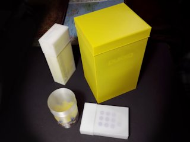
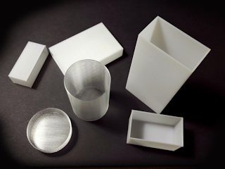
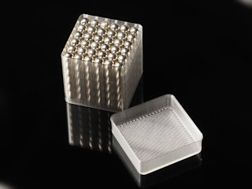

# Customizable simple spiral vase mode boxes
*3D printable boxes with configurable shape and size (formerly thing:3751596)*

### License
[Creative Commons - Attribution](https://creativecommons.org/licenses/by/4.0/)

### Gallery

[🔎](images/boxx1.jpg) [🔎](images/boxx2.jpg) [🔎](images/boxx3.jpg)

## Description and Instructions

This is an [OpenSCAD](https://openscad.org/) Customizer for making simple boxes of any dimensions with a rectangular, circular, elliptical, or polygonal cross-section, that must be printed in **spiral vase** mode (*spiralize outer contour, single outline corkscrew,* or whatever your particular slicing program calls it). This is a mode where, after printing a few bottom layers, the entire rest of the print is performed in one continuous movement that gradually increases the Z coordinate. This produces prints with no visible seams.

The lid has a little ‘lip’ that makes it easier to fit it on the box, and also provides some extra grip to pull the lid off. (About 90% of all the complexity of making the OpenSCAD code went into the maths to get this lip as I wanted it to be.)

These boxes come in handy especially as an extra protective shell for cardboard boxes, or to serve as a semi-airtight container for tea boxes or other things that need to be kept dry or away from odors.

Just enter the inside dimensions of the box in the **[OpenSCAD Customizer](https://www.dr-lex.be/3d-printing/customizer.html)**, choose the shape and tolerance for the lid, and generate the models. Make sure to set the extrusion width in your slicer to the exact same value as you entered as wall thickness in the customizer (default: 0.60 mm, which is a good value for a 0.4 mm nozzle).

If you want stronger boxes with multiple perimeters, of course you can also print the boxes in normal mode by setting infill to 0% and no top layers. The advantage of spiral vase mode is that it has no seams which makes the boxes look very nice, particularly circular ones.

The optimal tolerance depends on how tight you want the lid to be, and the accuracy of your printer. You will probably need a slightly higher tolerance for elliptical or polygonal boxes to get the same lid tightness as for rectangular ones. Mind that only the lid model varies if you change the tolerance, so if the tolerance proves too tight or sloppy, you only need to generate and print a new lid with a different tolerance.

All example models are made for a wall thickness of 0.6 mm.

## Hints for printing

Don't forget to set the extrusion width to match the value you have entered in Customizer. If you are not using vase mode and are using multiple perimeters, the extrusion width obviously is wall thickness divided by the number of perimeters.

The model is generated assuming that the bottom and top shell thickness are the same as the wall thickness. To ensure the printed model corresponds with this assumption, either configure the bottom thickness with the same value in your slicing program, or if you have to specify a number of layers, set the number of bottom layers such that the spiral starts above this thickness (for instance, for 0.2 mm layers and a 0.6 mm wall thickness, use 3 bottom layers).

If the lid isn't too tall or large, you may be able to print both the lid and box in one go while maintaining vase mode, by using sequential printing. Ensure the print starts with the lid and it is placed far enough from the box. Whether this is possible, depends on how much clearance there is around your extruder and below the guide rods.

Very large boxes with relatively thin walls may exhibit some buckling of the walls (visible on the big yellow box in the photos), but this shouldn't affect their usability.

## Updates

### 2019/07/17
First published on Thingiverse.

### 2020/05/21
I'm not sure if this has always been broken or it was due to the horrible Thingiverse website “update” from March 2020, but apparently Customizer just breaks with an obscure 404 error if there are non-ASCII characters in the SCAD file. So, I removed those and now it finally works.

### 2023/05/01
Migrated to GitHub. Added rounded corners option for rectangular boxes. Set the rounded corner radius to at least half the width or depth to produce a ‘pill’ shape.

## Tags
`box`, `container`, `openscad`, `parametric`, `spiral vase`, `Storage Box`, `vase mode`